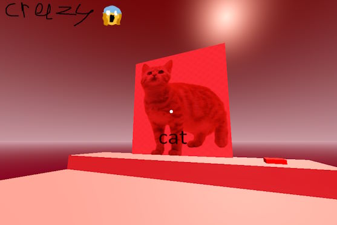

# Simple First Person Game template

A really simple first person game template, that contains really basic stuff.

This template contains:
- Player controller with basic movement (crouching, running, walking, looking with your mouse, etc)
- Interactions (Interactibles3D)
- Basic pause menu
- Basic main menu
- Debug information menu (sort of)
- that's about it

In theory, should work for all Godot 4.x versions.

## Getting Started

Delete /test_scene_assets/ and TestPlace node in the main scene, and you're good to go. 

Documentation is located in the scripts themselves and in that "Search Help" button on top of your script IDE thing.

